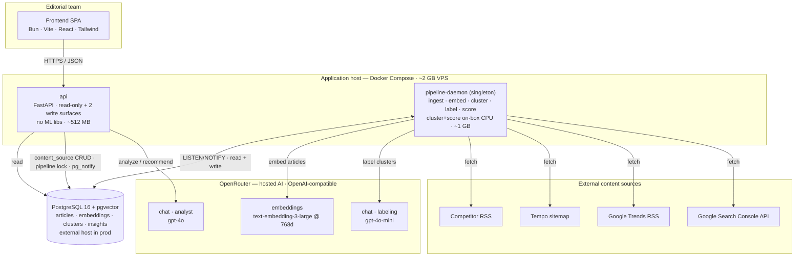
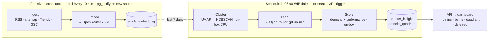

# Editor Intelligence

> Internal dashboard that surfaces **topics worth writing** for Tempo's editorial team.

Editor Intelligence ingests competitor RSS, the Tempo sitemap, and Google Trends, clusters
articles into topics, scores each topic on **demand × performance**, and serves the result to a
read-only dashboard. The goal is to answer one editorial question per topic every morning:
*does reader demand exist for this story, and is Tempo capturing it?*

AI inference (embedding, cluster labeling, the editorial analyst) runs **off-box through a hosted,
OpenAI-compatible API** (OpenRouter by default). Only classical ML — dimensionality reduction and
clustering — runs locally. This keeps the production footprint inside a ~2 GB VPS.

- **Repo:** `content-intelligence` · **Product name:** Editor Intelligence
- **Backend:** Python (`uv` workspace) · FastAPI · PostgreSQL 16 + pgvector
- **Frontend:** Bun · Vite · React · Tailwind v4 (`frontend/`)
- **Runtime:** Docker Compose, dev to prod

---

## The editorial model: demand × performance

Every clustered topic is placed in a 2×2 matrix from two orthogonal signals (decision **D35**):

- **Demand** — is there external interest? Derived from Google Trends match count, weighted trend
  score, and trend velocity.
- **Performance** — is Tempo already capturing that demand? Derived from internal coverage and
  Google Search Console signals (GSC numbers stay internal; only the derived level is exposed).

|                      | **Low / no performance** | **High performance** |
| -------------------- | ------------------------ | -------------------- |
| **High demand**      | `opportunity` 🎯          | `winning` 🏆          |
| **Low demand**       | `ignore`                 | `evergreen`          |

A fifth bucket, `too_early`, marks topics Tempo just covered but for which no GSC data exists yet.
The morning view ranks `opportunity` clusters first — high reader demand that Tempo has not yet won.

---

## System topology



The `api` process is intentionally lean — it imports **no** ML libraries and never runs inference.
It reads pre-computed data from Postgres, owns two narrow write surfaces (`content_source` CRUD and
the manual re-cluster trigger), and calls the hosted LLM **only** for the stateless analyst
endpoints. All heavy work happens in the supervised `pipeline-daemon`, which offloads embedding and
labeling to OpenRouter and runs clustering and scoring on-box.

## Pipeline data flow



One supervised daemon (`python -m pipeline.cli serve`) owns both flows:

- **Reactive ingest + embed (continuous).** Polls enabled RSS sources every 10 minutes, embeds
  inline after each ingest, and reacts to `pg_notify('rss_source_created')` to fetch a single new
  feed on demand. No operator action and no manual endpoint.
- **Scheduled cluster + label + score (06:00 WIB).** An in-process `asyncio` scheduler emits
  `pg_notify('pipeline_cluster_label_score_requested')`; the manual API trigger uses the same
  channel and code path. Clustering runs over the last 7 days; scoring upserts demand/performance
  signals into `cluster_insight`.

There is no host `cron`, no separate scheduler library, and no message queue — scheduling lives
inside the daemon as plain `asyncio` tasks. Single replica only.

---

## Backend modules (`backend/packages/`)

| Module       | Responsibility                                                | Inference | Depends on                |
| ------------ | ------------------------------------------------------------- | --------- | ------------------------- |
| `core`       | SQLAlchemy models, async DB session, Pydantic settings        | —         | (none)                    |
| `ingest`     | Fetch + persist RSS, sitemap, Trends RSS, GSC                 | —         | `core`                    |
| `embedding`  | Vectorize articles to 768d                                    | API\*     | `core`, `llm`             |
| `clustering` | UMAP → HDBSCAN topic clustering                               | on-box    | `core`                    |
| `labeling`   | Human-readable cluster labels                                 | API\*     | `core`, `llm`             |
| `scoring`    | Demand, performance, editorial quadrant                       | on-box    | `core`                    |
| `llm`        | Shared LLM client kernel — provider presets + structured I/O  | —         | (none)                    |
| `analyst`    | Editorial AI analyst — article scoring + recommendations      | API       | `core`, `llm`             |
| `api`        | FastAPI read-only layer + 2 write surfaces                    | API\*\*   | `core`, `analyst`         |
| `pipeline`   | Long-running daemon orchestrating all batch steps             | —         | `core` + all batch modules |

\* Defaults to the hosted API path (`EMBEDDING_PROVIDER=api`, `LABELING_PROVIDER=api`). The local
on-box path (torch / Gemma GGUF) is opt-in and requires the `pipeline-local` image.
\*\* The `api` process imports no ML modules; it calls the hosted LLM only for analyst endpoints.

**Rule:** `api` never imports ML modules. Batch modules never import each other — they share state
through `core` (DB kernel) or `llm` (LLM client kernel).

---

## Quickstart

All backend commands run from `backend/`. Local dev runs in Docker.

```bash
cd backend
cp .env.example .env
# Set your OpenRouter key for the API inference path (embedding + labeling + analyst):
#   EMBEDDING_API_KEY=sk-or-...
#   LABELING_LLM_API_KEY=sk-or-...
#   ANALYST_LLM_API_KEY=sk-or-...

docker compose up -d postgres
docker compose run --rm api alembic upgrade head
docker compose up -d           # postgres + api + pipeline-daemon (+ frontend in dev)
docker compose logs -f api
```

The frontend dev server runs from `frontend/` with `bun run dev` and points at the compose API.

**Ad-hoc pipeline steps** (manual profile, slim `pipeline-api` image):

```bash
docker compose --profile manual run --rm pipeline ingest   # also: embed cluster label score run-daily reembed
```

**Tests:**

```bash
docker compose run --rm api pytest packages/<module>/tests/
```

Full operational reference: [`docs/operations-sop.md`](docs/operations-sop.md).

---

## API surface

Read-dominant. The live contract is FastAPI's OpenAPI spec at `/docs` (`/openapi.json`). Highlights:

| Method | Path                                       | Purpose                                       |
| ------ | ------------------------------------------ | --------------------------------------------- |
| GET    | `/api/v1/clusters/morning`                 | Opportunity clusters ranked by demand × perf  |
| GET    | `/api/v1/clusters/bento`                   | All current clusters, ranked + paginated      |
| GET    | `/api/v1/clusters/quadrant/{quadrant}`     | Top clusters in one editorial quadrant        |
| GET    | `/api/v1/clusters/quadrant-summary`        | Quadrant distribution across current clusters |
| GET    | `/api/v1/clusters/deferred`                | High-demand, uncovered, stale topics          |
| GET    | `/api/v1/clusters/{id}`                    | Cluster detail with member articles           |
| GET    | `/api/v1/clusters/{id}/volume-trend`       | Competitor vs internal volume per WIB bucket  |
| GET    | `/api/v1/articles`                         | Paginated ingested articles                   |
| GET    | `/api/v1/articles/volume-trend`            | Article volume per WIB bucket by source type  |
| GET    | `/api/v1/sources` · POST · PATCH · DELETE  | RSS source management (write surface #1)       |
| POST   | `/api/v1/pipeline/cluster-label-score`     | Manual re-cluster trigger (write surface #2)   |
| GET    | `/api/v1/pipeline/status`                  | Pipeline run status                           |
| POST   | `/api/v1/analyst/analyze` · `/analyze/batch` · `/recommendation` | Stateless editorial analyst (no DB writes) |
| GET    | `/api/v1/health`                           | DB connectivity check                         |

Every cluster, article, and trend-signal endpoint is read-only. Authentication is handled by an
upstream gateway (out of scope for this codebase). GSC metrics are scoring inputs only and are never
returned via the API (only the derived editorial levels are).

---

## Documentation

`docs/README.md` is the documentation entry point. Read these four before writing code:

| Doc | What it covers |
| --- | --- |
| [`docs/prd.md`](docs/prd.md) | Product context, personas, what is out of scope |
| [`docs/architecture.md`](docs/architecture.md) | Modules, data flow, dependency graph, topology |
| [`docs/constraints.md`](docs/constraints.md) | What **not** to build (backend + frontend) |
| [`docs/schema.dbml`](docs/schema.dbml) | Database tables and relationships |

Other references: [`decisions.md`](docs/decisions.md) (why each choice was made),
[`llm-models.md`](docs/llm-models.md) (models, API vs local, vendor switching),
[`conventions.md`](docs/conventions.md), [`frontend.md`](docs/frontend.md), and the four hardening
SOPs ([`docker-sop`](docs/docker-sop.md), [`logging-sop`](docs/logging-sop.md),
[`operations-sop`](docs/operations-sop.md), [`hardening-sop`](docs/hardening-sop.md)).

## Out of scope

Authentication, production deploy infrastructure beyond Docker Compose, production hosting/serving
config, and the monitoring stack are owned by other teams. See `docs/architecture.md` §"Out of this
codebase" and PRD §6 for deferred features.
